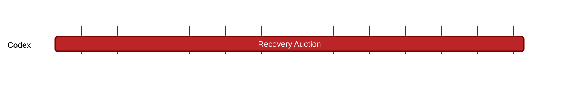

### `vac:tke::codex:recovery-auction`
---

- status: 0%
- CC: Frederico

### Description
Define details of the auction mechanisms for the slot recovery.

### Justification
As part of Codex Technical Milestones #6 ("Data Repair").

### Deliverables
- Modeling and Simulations of the auction mechanism
- One section of the Codex Litepaper "Modeling" chapter (the milestones [contract-initiation](contract-initiation.md), [contract-matching](contract-matching.md), [contract-defaults](contract-defaults.md), [contract-finalization](contract-finalization.md), [proof-aggregators](proof-aggregators.md), [slot-repair](slot-repair.md), and [tax-system](tax-system.md) cover the remaining parts of this chapter).

### Tracking Metrics
- Timely delivery of the report
- Agreement with Codex team and stakeholders

### Work breakdown
- Define what triggers and ends the auction recovery mechanism
- Design the Dutch Auction
- Evaluate impact on CDX price stability

### Perceived Risks
Technical and legal constraints.
