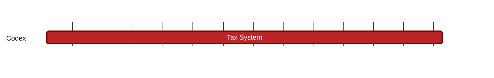

### `vac:tke::codex:tax-system`
---

- status: 10%
- CC: Frederico

### Description

### Justification
As part of Codex Technical Milestones #1 ("Proof Aggregation") and #2 ("Aggregator Network").

### Resources Required
- 1 CC working at 50% rate
- no external service required
- no special infrastructure required

### Deliverables
- Modeling and Simulations
- Report 

### Tracking Metrics
- Timely delivery of the report
- Agreement with Codex team and stakeholders

### Work breakdown
- Definition of a tax system
- Analysis of the application of taxes
- Analysis of CDX price stability

### Perceived Risks
Technical and legal constraints.