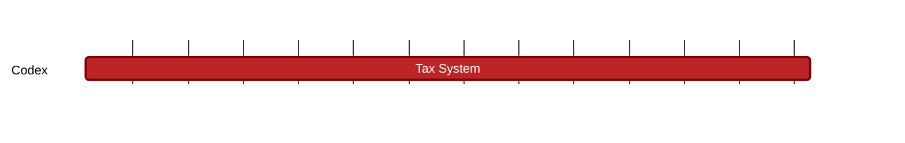

### `vac:tke::codex:tax-system`
---

- status: 10%
- CC: Frederico

### Description

### Justification
As part of Codex Technical Milestones #1 ("Proof Aggregation") and #2 ("Aggregator Network").

### Deliverables
- Modeling and Simulations of the CDX stability
- One section of the Codex Litepaper "Modeling" chapter (the milestones [contract-initiation](contract-initiation.md), [contract-matching](contract-matching.md), [contract-defaults](contract-defaults.md), [contract-finalization](contract-finalization.md), [proof-aggregators](proof-aggregators.md), [recovery-auction](recovery-auction.md), and [slot-repair](slot-repair.md) cover the remaining parts of this chapter).

### Tracking Metrics
- Timely delivery of the report
- Agreement with Codex team and stakeholders

### Work breakdown
- Definition of a tax system
- Analysis of the application of taxes
- Analysis of CDX price stability

### Perceived Risks
Technical and legal constraints.
