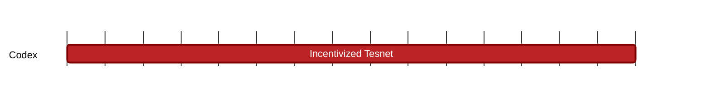

### `vac:tke::codex:testnet-incentive`
---

- status: 0%
- CC: Frederico, Martin, Juan

### Description
Design incentives for testnet.

### Justification
As part of Codex Production Milestone #4 (Codex v1 Mainnet Launch)

### Resources Required
1 CC working at 50% rate; no external service or special infrastructure required.

### Deliverables
Report with analyses of incentives and expected consequences

### Tracking Metrics
Delivery of the report, and agreement with team and stakeholders.

### Work breakdown
- Definition of optimization goals
- Definition of metrics
- Analysis of incentives

### Perceived Risks
Technical and legal constraints.
