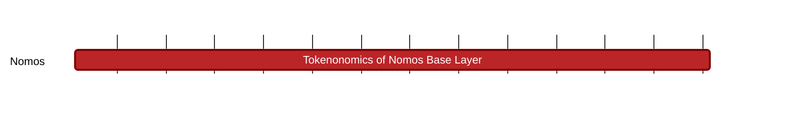

## `vac:tke::nomos:base-layer`
---

- status: 10%
- CC: Frederico, Juan, Martin

### Description
Understand and define the role of a token inside the PoS consensus and the data availability protocols.

### Justification
Analysis of incentives of the protocols that form the Nomos' base layer.

### Deliverables
- Reports with analysis and directives
- Modeling and simulation

### Tracking Metrics
- Timely delivery of reports
- Aggrement with Nomos team and other stakeholders

### Work breakdown
- Understand whether wealth concentration can emerge when validators modify the fork choice rule of the protocol
- Define how much tokens are distributed as rewards to block proposers
- Design block space pricing mechanism
- Define actions that lead to rewards and penalties on Nomos
- Define token initial supply, distribution, allocations
- Define sustainable incentives for mixnets operators
- Define sustainable incentives for data availability validators
- Understand what other chains are doing with respect to delegation and restaking
- Define the best way to incorporate delegation into Nomos

### Perceived Risks
Technical and legal constraints
