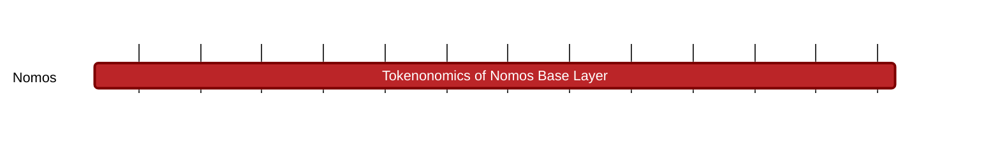

## `vac:tke::nomos:coordination-layer`
---

- status: 0%
- CC: Frederico, Juan, Martin

### Description
Understand and define the role of a token inside the PoS consensus and the data availability protocols.

### Justification
Analysis of incentives of the protocols that form the Nomos' coordination layer.

### Deliverables
- Reports with analysis and directives
- Modeling and simulation

### Tracking Metrics
- Timely delivery of reports
- Aggrement with Nomos team and other stakeholders

### Work breakdown
- Pricing mechanisms for transaction aggregation

### Perceived Risks
Technical and legal constraints
