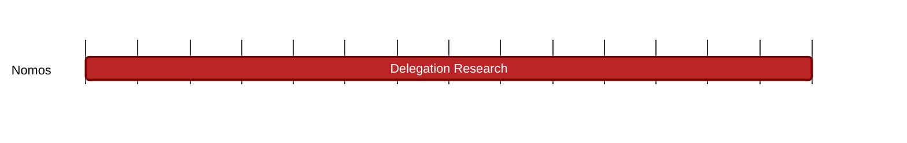

## `vac:tke::nomos:delegation-research`
---

- status: 0%
- CC: Frederico

### Description

Understand what other chains are doing with respect to delegation and restaking.

### Justification

As part of Nomos PoS development.
