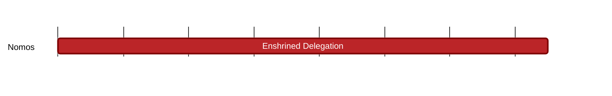

## `vac:tke::nomos:enshrined-delegation`
---

- status: 0%
- CC: Frederico

### Description

Define the best way is to incorporate delegation and restaking into Nomos.

### Justification

As part of Nomos PoS development.
