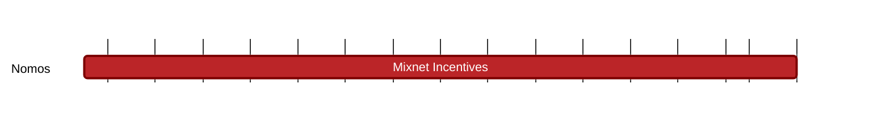

## `vac:tke::nomos:mixnet-incentives`
---

- status: 1%
- CC: Frederico

### Description

Sustainable mixnets need to be properly incentivized.

### Justification

As part of Nomos privacy requirements.
