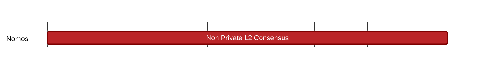

## `vac:tke::nomos:non-private-L2-consensus`
---

- status: 0%
- CC: Frederico

### Description

These will work likely with isolated pools. Since these are pools, would also be important to understand.

### Justification

As part of Nomos development.
