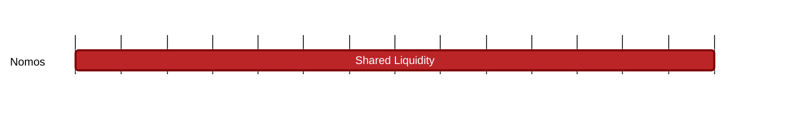

## `vac:tke::nomos:shared-liquidity`
---

- status: 0%
- CC: Frederico

### Description

Understand the problem of L2 liquidity fragmentation in general.

### Justification

As part of PoS development.
