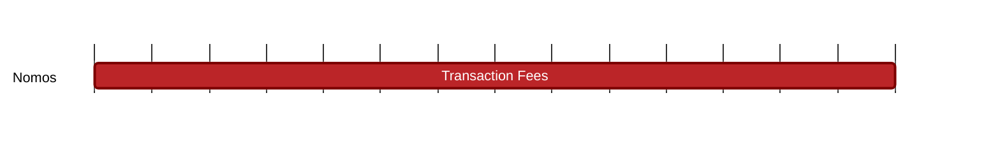

## `vac:tke::nomos:transaction-fee`
---

```mermaid
%%{ 
  init: { 
    'theme': 'base', 
    'themeVariables': { 
      'primaryColor': '#BB2528', 
      'primaryTextColor': '#fff', 
      'primaryBorderColor': '#7C0000', 
      'lineColor': '#F8B229', 
      'secondaryColor': '#006100', 
      'tertiaryColor': '#fff' 
    } 
  } 
}%%
gantt
	dateFormat YYYY-MM-DD 
	section Nomos
		Transaction Fees :, 2024-05-01, 2024-05-15
```
- status: 0%
- CC: Frederico

### Description

Design block space pricing mechanism.

### Justification

As part of Nomos PoS development.
