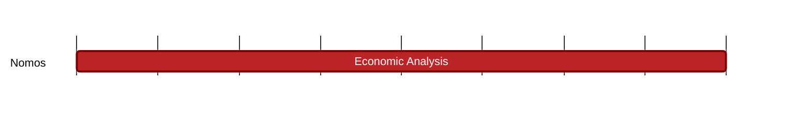

## `vac:tke::nomos:validator-rewards`
---

- status: 0%
- CC: Frederico

### Description

Define how much tokens are distributed as rewards to block proposers.

### Justification

As part of PoS development.
