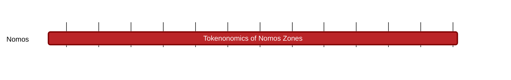

## `vac:tke::nomos:zones-layer`
---

- status: 10%
- CC: Frederico, Juan, Martin

### Description
Understand and define the role of a token inside the PoS consensus and the data availability protocols.

### Justification
Analysis of incentives of the protocols that form the Nomos' base layer.

### Deliverables
- Reports with analysis and directives
- Modeling and simulation

### Tracking Metrics
- Timely delivery of reports
- Aggrement with Nomos team and other stakeholders

### Work breakdown
- Understand the problem of L2 liquidity fragmentation in general
- Understand what other chains are doing with respect to restaking
- Define the best way is to incorporate restaking into Nomos
- Understand the dynamics of non-private L2 consensus

### Perceived Risks
Technical and legal constraints
