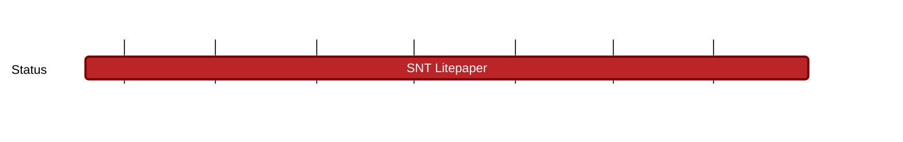

## `vac:tke::status:SNT-litepaper`
---

- status: 70% - delayed: governance proposal taking precedence
- CC: Matty

## Description

* delayed, other milestones took precedence
* Per confirmation with John on 2023/08/22 litepaper is not a pressing need, much lower priority than governance proposal

## Justification

* helpful to support relaunch of Status app and describe SNT’s new staking features
