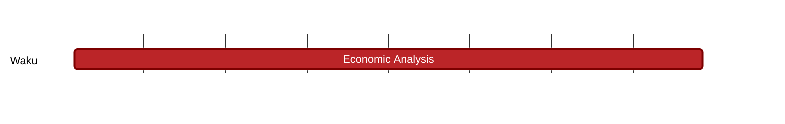

## `vac:tke::waku:rln-membership`
---

- status: 30%
- CC: Martin

#### Description

Desigh a comprehensive strategy for RLN memberships, perhaps following the NFT-like approach. Strategy should consider pricing mechanisms, payment options, dev/node compensation and project sustainability, security, etc.
