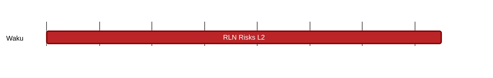

## `vac:tke::waku:rln-risks-L2`
---

```mermaid
%%{ 
  init: { 
    'theme': 'base', 
    'themeVariables': { 
      'primaryColor': '#BB2528', 
      'primaryTextColor': '#fff', 
      'primaryBorderColor': '#7C0000', 
      'lineColor': '#F8B229', 
      'secondaryColor': '#006100', 
      'tertiaryColor': '#fff' 
    } 
  } 
}%%
gantt
	dateFormat YYYY-MM-DD 
	section Waku
		RLN Risks L2 :, 2024-04-15, 2024-04-30
```
- status: 0%
- CC: Martin

#### Description

Drive the discussion around feasibility/risks for RLN on L2, leading to a recommendation of a specific L2.
