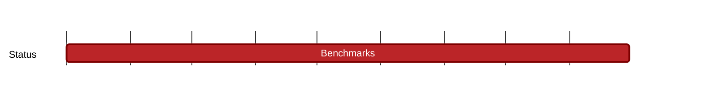

## `vac:zkvm:proofsystems:vac:benchmarks`
---

- status: 70%
- CC: team

### Description

Comprises:

* research log post
* make benchmark repo public + README (explaining how to execute benchmarks)
* benchmarks (recursive) for all current proof-systems (unless there is a good reason not to include one)
* scientific paper

### Deliverables

