# Waku Roadmap 2024 Gantt Chart

Status short term work only:

- reliability for 1:1 chat and communities
- up to 100 communities

Colour legend:

- **Red**: engineering work to deliver the feature.
- Other: test and telemetry work to ensure quality

Anything prefixed `TBC` is pending confirmation of estimate with the team.

Completion dates are delivery of the code + **dogfooding**.

If too hard to read, try to see this fine in [GitHub](https://github.com/logos-co/roadmap/blob/v4/content/waku/2024-gantt.md).

```mermaid
gantt
    dateFormat YYYY-MM-DD
    axisFormat %d-%b
    weekday monday
    
%% Milestones overview with deliverables
    section Store Service Upgrade
        Store v3 (sync): crit, milestone, after storev3sync-r storev3sync-n, 0
        DoS protection for req-res protocols: crit, milestone, after dosreqres-n dosreqres-g, 0
        PostgreSQL maintenance: crit, milestone, after pgsql-m, 0
    section Direct Message Reliability
        (telemetry) direct message reliability: milestone, after telem-d-msg-rel-1 telem-d-msg-rel-2, 0
        Reliability Protocol for Resource-Restricted Clients: crit, milestone, after rel-reqres-j-1 rel-reqres-j-2, 0
        Review MVDS usage and fail path: crit, milestone, after mvds, 0
        PostgreSQL optimisation - phase 1: milestone, after pgsql-opt-1, 0
    section E2e reliability protocol
        (telemetry) Multicast message reliability: milestone, after telem-m-msg-rel, 0
        E2e reliability protocol PoC: milestone, crit, after e2e-rel-r, 0
        E2e reliability protocol Status integration: milestone, crit, after e2e-rel-status-r e2e-rel-status-g, 0
    section Static Sharding - dedicated shards
        (telemetry) Measure Bandwidth: milestone, after telem-bandwidth, 0
        Sharding peer mgmt and discovery hardening: crit, milestone, after sh-peer-mgmt-n sh-peer-mgmt-g, 0
        (testing) Custom shard impl of Communities: milestone, after test-custom-shard, 0
        PostgreSQL optimisation - phase 2: milestone, after pgsql-opt-2, 0
    section Bandwidth optimisation and protocol review
        %% TODO: deliverables are being re-worked
        Specify de-MLS over Waku: milestone, after demls-spec, 0
        Review usage of content topics in Status Chat and Communities protocol: milestone, after cont-topic-r, 0
        Minimal Community Specification and Implementation: milestone, after min-com-spec, 0
        %% TODO: schedule
        Telemetry review: milestone, after telem-review, 0
        Minimal solution for greedy messages: milestone, after min-sol-com, 0
        Define long-term solution: milestone, after define-com-sol, 0
    section Nwaku in Status Desktop (Relay mode)
        Nwaku on Windows: milestone, after nwaku-windows-n, 0
        Nwaku in Status Desktop: milestone, after nwaku-status-desktop, 0
    section Scale 1-1 chat messages PoC
        %% Asking for a dashboard
        Provision RLN for light push clients PoC: milestone, after provision-rln, 0
        Pay for RLN provision first PoC: milestone, after rlnaas-r, 0
        Implement RLN smart contract for paid, multilevel memberships: milestone, after rln-sc-r rln-sc-d, 0
        Public dogfooding web app: milestone, after pub-dogfood-web-app-1 pub-dogfood-web-app-2, 0
    section Scale up number of Communities
        Usage of rendezvous: milestone, after rendezvous-r, 0
    section Demonstrate product market-fit
        Define cost (self-host): milestone, after define-cost, 0
        Define potential USPs: milestone, after define-usps, 0
        Define target customers: milestone, after define-custs, 0
        Customer interviews: milestone, after cust-int, 0
        Co-design sessions: milestone, after codesign-bd codesign-se, 0
        Review Waku MVP: milestone, 2025-01-15, 0

%% Tasks
    section Chat.plopezlpz
        (testing) Custom shard impl of Communities: test-custom-shard, 2024-08-26, 2024-09-30
    section Chat.kaichaosun
        Review MVDS usage and fail path: crit, mvds, 2024-08-01, 2024-09-30
        %% TODO estimate
        Minimal Community Specification and Implementation: min-com-spec, after mvds, 12w
    section Go.richard-ramos
        Implement RLN smart contract for paid, multilevel memberships: rln-sc-d, 2024-09-01, 6w
        %% TODO: Estimate
        Nwaku in Status Desktop: nwaku-status-desktop-g, after rln-sc-d, 12w
    section Go.chaitanyaprem
        DoS Protection for Req-Res Protocols: crit, dosreqres-g, 2024-08-01, 2024-09-15
        Sharding peer mgmt and discovery hardening: crit, sh-peer-mgmt-g, 2024-08-26, 2024-09-12
        %% TODO review estimate
        Review usage of content topics in Status Chat and Communities protocol: cont-topic-r, after sh-peer-mgmt-g, 12w
    section EcoDev.vpavlin
        (telemetry) direct message reliability: telem-d-msg-rel-1, 2024-08-26, 2024-09-25
        %% TODO: do bandwidth telemetry?
        E2e reliability protocol Status integration: crit, e2e-rel-status-g, after e2e-rel-r, 6w
        %% TODO: fit that properly
        Specify de-MLS over Waku: demls-spec, 2024-10-01, 4w
        Co-design sessions: codesign-bd, after cust-int, 2024-11-15
    section Go.adklempner
        (telemetry) direct message reliability: telem-d-msg-rel-2, 2024-08-01, 2024-09-25
        %% TODO: this deliverable needs to be reviewed, bw should be prioritized
        (telemetry) Multicast message reliability: telem-m-msg-rel, after telem-d-msg-rel-2, 4w
        (telemetry) Measure Bandwidth: telem-bandwidth, after telem-m-msg-rel, 8w
    section Test.stubbsta
        %% TODO Review estimate
        (simulation) Functionality and stress test store v3: sim-storev3, 2024-08-01, 8w
        (simulation) relay reliability performance impact: sim-relay-rel, after sim-store-cmp sim-req-res, 4w
        (simulation) req-res reliability performance impact: sim-reqres-rel, after sim-relay-rel, 6w
    section Res.shash256
        E2e reliability protocol - PoC: crit, e2e-rel-r, 2024-08-01, 2024-09-06
        E2e reliability protocol Status integration: e2e-rel-status-r, after e2e-rel-r, 10w 
    section Res.sionois
        %% Only dogfooding remaining
        Store v3 (sync): crit, storev3sync-r, 2024-08-01, 2024-09-20
        Store v3 - follow-up: after storev3-r, 8w
        Peer mgmt - follow-up: after storev3-r, 8w
        Usage of rendezvous: rendezvous-r, after storev3sync-r, 8w
    section Res.alrevuelta
    section Res.s-tikhomirov
        Implement RLN smart contract for paid, multilevel memberships: rln-sc-d, 2024-09-01, 6w
        %% TODO Estimate
        Pay for RLN provision first PoC: rlnaas-r, 2024-09-01, 8w
    section Nim.Ivansete
        Store v3 (sync): crit, storev3sync-n, 2024-08-15, 2024-09-20
        PostgreSQL Maintenance: crit, pgsql-m, 2024-08-01, 2024-09-18
        %% TODO review date/estimate
        PostgreSQL Optimisation - phase 1: pgsql-opt-1, after pgsql-m, 8w
        PostgreSQL Optimisation - phase 2: pgsql-opt-2, after pgsql-opt-1, 8w
        %% TODO: Estimate
        Nwaku in Status Desktop: nwaku-status-desktop-2, after pgsql-opt-1, 6w
    section Nim.NagyZoltanPeter
        DoS Protection for Req-Res Protocols: crit, dosreqres-n, 2024-08-01, 2024-09-15
        %% TODO review
        TBC Store v3-beta + v3 (nwaku hardening): crit, storev3-n, after storev3-df dosreqresn, 3w
        Nwaku in Status Desktop: nwaku-status-desktop-n, after storev3-n, 12w
    section Nim.gabrielmer
        Sharding peer mgmt and discovery hardening: crit, sh-peer-mgmt-n, 2024-08-01, 2024-09-12
    section Nim.darshankabariya
        %% TODO: review estimate
        Nwaku on Windows: nwaku-windows-n, 2024-08-15, 6w
    section Js.weboko
        Reliability Protocol for Resource-Restricted Clients: crit, rel-reqres-j-1, 2024-08-01, 2024-09-13
        %% TODO estimate
        Public dogfooding web app: pub-dogfood-web-app-1, after rel-reqres-j-1, 8w
    section Js.danisharora099
        Reliability Protocol for Resource-Restricted Clients: crit, rel-reqres-j-2, 2024-08-01, 2024-09-13
        %% TODO estimate
        Public dogfooding web app: pub-dogfood-web-app-2, after rel-reqres-j-2, 8w
    section BD.pedro
        Define cost (self-host): define-cost, 2024-08-01, 2024-11-30
        Define potential USPs: define-usps, 2024-09-01, 2024-11-30
        Define target customers: define-custs, 2024-09-01, 2024-09-30
        Customer interviews: cust-int, after define-custs, 2024-10-31
        Co-design sessions: codesign-bd, after cust-int, 2024-11-15
```

