# Waku Roadmap 2024 Gantt Chart

Status short term work only:

- reliability for 1:1 chat and communities
- up to 100 communities

Colour legend:

- **Red**: engineering work to deliver the feature.
- Other: test and telemetry work to ensure quality

Prefix legend:
- `TBC`: Yet to be scheduled or estimation needs to be locked in.

Completion dates are delivery of the code + **dogfooding**.

If too hard to read, try to see this file in [GitHub](https://github.com/logos-co/roadmap/blob/v4/content/waku/2024-gantt.md).

```mermaid
gantt
    dateFormat YYYY-MM-DD
    axisFormat %d-%b
    weekday monday
    
%% Team legend:
%% task name: team (accountable person)
%% - r-*: research (jm-clius)
%% - t-*: telemetry (fryorcraken)
%% - n-*: nwaku (ivansete)
%% - j-*: js-waku (weboko)
%% - c-*: chat (plopezlpz)
%% - g-*: go-waku (fryorcraken)
%% - bd-*: BD (pedro)
%% - se-*: Solution Engineer (vpavlin)
    
%% Milestones overview with deliverables
    section Store Service Upgrade
        Store v3 (sync): crit, milestone, after r-storev3sync n-storev3sync, 0
        DoS protection for req-res protocols: crit, milestone, after n-dosreqres g-dosreqres, 0
        PostgreSQL maintenance: crit, milestone, after n-pgsql-m, 0
    section Direct Message Reliability
        (telemetry) direct message reliability: milestone, after t-d-msg-rel-1 t-d-msg-rel-2, 0
        Reliability Protocol for Resource-Restricted Clients: crit, milestone, after j-rel-reqres-1 j-rel-reqres-2, 0
        Review MVDS usage and fail path: crit, milestone, after c-mvds, 0
        PostgreSQL optimisation - phase 1: milestone, after n-pgsql-opt-1, 0
    section E2e reliability protocol
        E2e reliability protocol PoC: milestone, crit, after r-e2e-rel, 0
        E2e reliability protocol Status integration: milestone, crit, after r-e2e-rel-status c-e2e-rel-status, 0
    section Static Sharding - dedicated shards
        (telemetry) Measure Bandwidth: milestone, after t-bandwidth, 0
        (telemetry) Sharding: milestone, after t-sharding, 0
        Sharding peer mgmt and discovery hardening: crit, milestone, after n-shard-peer-mgmt g-shard-peer-mgmt, 0
        (testing) Custom shard impl of Communities: milestone, after c-test-custom-shard, 0
        PostgreSQL optimisation - phase 2: milestone, after n-pgsql-opt-2, 0
        Setup Waku Community on dedicated shard with pre-shared key dos protection: milestone, after waku-com, 0
    section Bandwidth optimisation and Communities protocol review
        %% For now same person scheduled to do both research and implementation
        Minimal Community Specification and Implementation: milestone, after r-min-com-spec c-min-com-spec, 0
        Review usage of content topics in Status Communities protocol: milestone, after r-cont-topic, 0
        Specify de-MLS over Waku: milestone, after r-demls-spec, 0
        %% TODO: schedule
        TBC Telemetry review: milestone, after r-telem-review, 0
        TBC Minimal solution for greedy messages: milestone, after r-min-sol-com, 0
        TBC Define long-term solution: milestone, after r-define-com-sol, 0
    section Nwaku in Status Desktop (Relay mode)
        Nwaku on Windows: milestone, after n-nwaku-windows, 0
        Nwaku in Status Desktop: milestone, after n-nwaku-status-desktop, 0
    section RLN Mainnet
        Implement RLN smart contract for paid, multilevel memberships: milestone, after r-rln-sc n-rln-sc j-rln-sc, 0
        Public dogfooding RLNaaS web app: milestone, after j-pub-dogfood-web-app-1 j-pub-dogfood-web-app-2, 0
    section Scale up number of Communities
        Usage of rendezvous: milestone, after r-rendezvous, 0
    section Incentivise running a Waku infrastructure node
        RLN Relay Incentivisation: milestone, after r-rln-relay-incent, 0
        Service Incentivisation: milestone, after r-svc-incent, 0
    section Demonstrate product market-fit
        Define cost (self-host): milestone, after bd-define-cost, 0
        Define potential USPs: milestone, after bd-define-usps, 0
        Define target customers: milestone, after bd-define-custs, 0
        Customer interviews: milestone, after cust-int, 0
        Co-design sessions: milestone, after bd-codesign se-codesign, 0
        Review Waku MVP: milestone, 2025-01-15, 0

%% Tasks
    section Chat.plopezlpz
        (testing) Custom shard impl of Communities: c-test-custom-shard, 2024-08-26, 2024-09-30
        Setup Waku Community on dedicated shard with pre-shared key dos protection: waku-com, after c-test-custom-shard, 2w
    section Chat.kaichaosun
        Review MVDS usage and fail path: crit, c-mvds, 2024-08-01, 2024-09-30
        Minimal Community Specification and Implementation: c-min-com-spec, after c-mvds, 12w
    section Go.richard-ramos
        Implement RLN smart contract for paid, multilevel memberships: r-rln-sc, 2024-09-01, 6w
        %% TODO: Estimate
        Nwaku in Status Desktop: n-nwaku-status-desktop, after n-rln-sc, 2025-01-31
        Status Support: status-support-rr, 2024-09-01, 2024-12-31
    section Go.chaitanyaprem
        DoS Protection for Req-Res Protocols: crit, g-dosreqres, 2024-08-01, 2024-09-15
        Sharding peer mgmt and discovery hardening: crit, g-shard-peer-mgmt, 2024-08-26, 2024-09-12
        Review usage of content topics in Status Communities protocol: r-cont-topic, after g-shard-peer-mgmt, 10w
    section EcoDev.vpavlin
        (telemetry) direct message reliability: t-d-msg-rel-1, 2024-08-26, 2024-09-25
        (telemetry) Measure Bandwidth: t-bandwidth, after t-d-msg-rel-1, 8w
        %% TODO: do bandwidth telemetry?
        E2e reliability protocol Status integration: crit, c-e2e-rel-status, after r-e2e-rel, 6w
        %% TODO: fit that properly
        Specify de-MLS over Waku: r-demls-spec, 2024-10-01, 4w
        Co-design sessions: bd-codesign, after cust-int, 2024-11-15
    section Go.adklempner
        (telemetry) direct message reliability: t-d-msg-rel-2, 2024-08-01, 2024-09-25
        (telemetry) sharding: t-sharding, after t-d-msg-rel-2, 4w
    section Test.stubbsta
        (simulation) Functionality and stress test store v3: sim-storev3, 2024-07-08, 8w
        (simulation) Functionality and stress test store v3 sync: sim-storesync, 2024-09-01, 10w
        (simulation) Reliability performance impact: sim-rel, after sim-storesync, 10w
    section Res.shash256
        E2e reliability protocol - PoC: crit, r-e2e-rel, 2024-08-01, 2024-09-06
        E2e reliability protocol Status integration: r-e2e-rel-status, after r-e2e-rel, 10w 
    section Res.sionois
        %% Only dogfooding remaining
        Store v3 (sync): crit, r-storev3sync, 2024-08-01, 2024-09-20
        Store v3 - follow-up: after storev3-r, 8w
        Peer mgmt - follow-up: after storev3-r, 8w
        Usage of rendezvous: r-rendezvous, after r-storev3sync, 8w
    section Res.alrevuelta
        RLN Relay Incentivisation: r-rln-relay-incent, 2024-09-01, 2024-12-31
    section Res.s-tikhomirov
        Implement RLN smart contract for paid, multilevel memberships: rln-sc-d, 2024-09-01, 6w
        Service Incentivisation: r-svc-incent, 2024-09-01, 2024-12-31
    section Nim.Ivansete
        Store v3 (sync): crit, n-storev3sync, 2024-08-15, 2024-09-20
        PostgreSQL Maintenance: crit, n-pgsql-m, 2024-08-01, 2024-09-18
        %% TODO review date/estimate
        PostgreSQL Optimisation - phase 1: n-pgsql-opt-1, after n-pgsql-m, 6w
        PostgreSQL Optimisation - phase 2: n-pgsql-opt-2, after n-pgsql-opt-1, 8w
        %% TODO: Estimate
        Nwaku in Status Desktop: n-nwaku-status-desktop-2, after n-pgsql-opt-1, 6w
    section Nim.NagyZoltanPeter
        DoS Protection for Req-Res Protocols: crit, n-dosreqres, 2024-08-01, 2024-09-15
        %% TODO review
        TBC Store v3-beta + v3 (nwaku hardening): crit, storev3-n, after storev3-df dosreqresn, 3w
        Nwaku in Status Desktop: n-nwaku-status-desktop-n, after storev3-n, 12w
    section Nim.gabrielmer
        Sharding peer mgmt and discovery hardening: crit, n-shard-peer-mgmt, 2024-08-01, 2024-09-12
    section Nim.darshankabariya
        %% TODO: review estimate
        Nwaku on Windows: n-nwaku-windows, 2024-08-15, 6w
    section Js.weboko
        Reliability Protocol for Resource-Restricted Clients: crit, j-rel-reqres-1, 2024-08-01, 2024-09-13
        Public dogfooding RLNaaS web app: j-pub-dogfood-web-app-1, after j-rel-reqres-1, 8w
        Implement RLN smart contract (js-waku): j-rln-sc, after j-pub-dogfood-web-app-1, 10w
    section Js.danisharora099
        Reliability Protocol for Resource-Restricted Clients: crit, j-rel-reqres-2, 2024-08-01, 2024-09-13
        Public dogfooding RLNaaS web app: j-pub-dogfood-web-app-2, after j-rel-reqres-2, 8w
    section BD.pedro
        Define cost (self-host): bd-define-cost, 2024-08-01, 2024-11-30
        Define potential USPs: bd-define-usps, 2024-09-01, 2024-11-30
        Define target customers: bd-define-custs, 2024-09-01, 2024-09-30
        Customer interviews: cust-int, after bd-define-custs, 2024-10-31
        Co-design sessions: bd-codesign, after cust-int, 2024-11-15
```

