# Waku Roadmap 2024 Gantt Chart

Status short term work only:

- reliability for 1:1 chat and communities
- up to 100 communities

Colour legend:

- **Red**: engineering work to deliver the feature.
- Other: test and telemetry work to ensure quality

golang engineers: working on status-go/go-waku
nim engineers: working on nwaku, may be a CC from research team too.

Anything prefixed `TBC` is pending confirmation of estimate with the team.

```mermaid
gantt
    dateFormat YYYY-MM-DD
    axisFormat %d-%b
    tickInterval 1week
    weekday monday
    
%% Milestones overview with deliverables
    section Store Service Upgrade
        Store v3-beta (msg hash): crit, milestone, after storev3-br, 0
        Store v3 (sync): crit, milestone, after storev3-r storev3-g storev3-n, 0
        DoS protection for req-res protocols: crit, milestone, after dosreqresn dosreqresj dosreqresg, 0
        PostgreSQL maintenance: crit, milestone, after pgsql, 0
        (metric) Count store messages: milestone, after count-store-msg, 0
    section Direct Message Reliability
        (testing) direct messages: milestone, after test-direct-msg, 0
        Review connection management: crit, milestone, after review-conn-mgmt-1 review-conn-mgmt-2, 0
        (telemetry) Fleet logging: milestone, after telem-fleet-logging, 0
        (telemetry) direct message reliability: milestone, after telem-d-msg-rel, 0
        Reliability Protocol for Relay: crit, milestone, after rel-relay-g rel-relay-n, 0
        Reliability Protocol for Resource-Restricted Clients: crit, milestone, after rel-reqres-g rel-reqres-j, 0
        Review MVDS usage and fail path: crit, milestone, after mvds, 0
    section Static Sharding - dedicated shards
        (telemetry) Measure Bandwidth: milestone, after telem-bandwidth, 0
        Sharding peer mgmt and discovery hardening: crit, milestone, after sh-peer-mgmt-j sh-peer-mgmt-n sh-peer-mgmt-g, 0
        (testing) Custom shard impl of Communities: milestone, after test-custom-shard, 0
    section E2e reliability protocol
        (telemetry) Multicast message reliability: milestone, after telem-m-msg-rel, 0
        E2e reliability protocol PoC: milestone, crit, after e2e-rel-r, 0
        E2e reliability protocol Status integration: milestone, crit, after e2e-rel-g, 0

%% Tasks
    section golang eng 1
        %% Estimation TBC - Prem says fine, waiting on 2nd opinion
        TBC Review connection management: crit, review-conn-mgmt-1, 2024-05-13, 8w
        Review MVDS usage and fail path: crit, mvds, after review-conn-mgmt-1, 6w
        Investigation and fixing of bugs discovered during dogfooding/usage/simulations: go-bugs-1, after mvds, 8w
    section golang eng 2
        Reliability Protocol for Relay (go): crit, rel-relay-g, 2024-05-13, 12w
        (testing) direct messages: test-direct-msg, after rel-relay-g, 4w
        TBC (testing) Custom shard impl of Communities: test-custom-shard, after test-direct-msg, 4w
        %% TBC estimate
        TBC E2e reliability protocol Status integration: crit, e2e-rel-g, after e2e-rel-r, 10w
    section golang eng 3
        Store v3 (go-waku client only): crit, storev3-g, 2024-02-26, 2024-05-24
        %% Estimate TBC - assuming parallel work possible
        TBC Review connection management: crit, review-conn-mgmt-2, after storev3-g, 8w
        Sharding peer mgmt and discovery hardening (go-waku): crit, sh-peer-mgmt-g, after review-conn-mgmt-2, 8w
    section golang eng 4
        Store v3 (sync): crit, 2024-02-08, 2024-04-26
        Reliability Protocol for Resource-Restricted Clients (go): crit, rel-reqres-g, 2024-05-13, 10w
        (metric) Count store messages: count-store-msg, after rel-reqres-g, 2w
        Investigation and fixing of bugs discovered during dogfooding/usage/simulations: go-bugs-2, after count-store-msg, 8w
    section golang eng 5
        DoS protection for req-res protocols (go-waku client only): crit, dosreqresg, 2024-05-20, 4w
        (telemetry) direct message reliability: telem-d-msg-rel, 2024-06-17, 6w
        (telemetry) Multicast message reliability: telem-m-msg-rel, after telem-d-msg-rel, 4w
        (telemetry) Measure Bandwidth: telem-bandwidth, after telem-m-msg-rel, 8w
    section test eng 1
        Peer and connection management tests: sim-conn-mgmt, 2024-05-13, 4w
        (simulation) Functionality and stress test store v3: sim-storev3, after sim-conn-mgmt, 4w
        %% This is Store Service Upgrade - item (2) in DST simulation - start with small scale to get faster results
        (simulation) Compare store topologies: sim-store-cmp, after sim-storev3, 6w
        (simulation) relay reliability performance impact: sim-relay-rel, after sim-store-cmp sim-req-res rel-relay-g rel-relay-n, 4w
        (simulation) req-res reliability performance impact: sim-reqres-rel, after sim-relay-rel rel-reqres-g, 6w
    section research eng 1
        End-to-end reliability protocol - PoC: crit, e2e-rel-r, 2024-05-23, 20w
    section research eng 2
        %% Only dogfooding remaining
        Store v3-beta (msg hash): crit, storev3-br, 2024-01-01, 2024-05-23
        Store v3 (sync) research + RFC: crit, storev3-r, 2024-03-25, 14w
    section nim eng 1
        PostgreSQL Maintenance: crit, pgsql, 2024-01-01, 2024-05-24
        Reliability Protocol for Relay (nwaku + RFC): crit, rel-relay-n, 2024-05-13, 12w
    section nim eng 2
        DoS Protection for Req-Res Protocols: crit, dosreqresn, 2024-02-01, 18w
        Store v3-beta + v3 (dogfooding placeholder):  storev3-df, after storev3-br storev3-r, 4w
        Store v3-beta + v3 (nwaku hardening): crit, storev3-n, after storev3-df dosreqresn, 3w
        (telemetry) Fleet logging: telem-fleet-logging, after dosreqresn, 4w
    section nim eng 3
        %% TBC estimate/end
        TBC Sharding peer mgmt and discovery hardening (nwaku): crit, sh-peer-mgmt-n, 2024-05-13, 6w
    section js eng 1
        Reliability for Req-Res Protocols (light client + RFC): crit, rel-reqres-j, 2024-05-01, 12w
    section js eng 2
        %% TBC scope
        TBC Sharding peer mgmt and discovery hardening (light client + RFC): crit, sh-peer-mgmt-j, 2024-06-01, 12w
```

