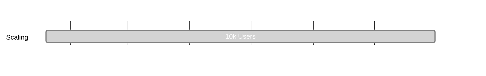

```mermaid
%%{ 
  init: { 
    'theme': 'base', 
    'themeVariables': { 
      'primaryColor': '#BB2528', 
      'primaryTextColor': '#fff', 
      'primaryBorderColor': '#7C0000', 
      'lineColor': '#F8B229', 
      'secondaryColor': '#006100', 
      'tertiaryColor': '#fff' 
    } 
  } 
}%%
gantt
	dateFormat YYYY-MM-DD 
	section Scaling
		10k Users :done, 2023-01-20, 2023-07-31
```

## Completion Deliverable
TBD

## Epics
- [Github Issue Tracker](https://github.com/waku-org/pm/issues/12)
