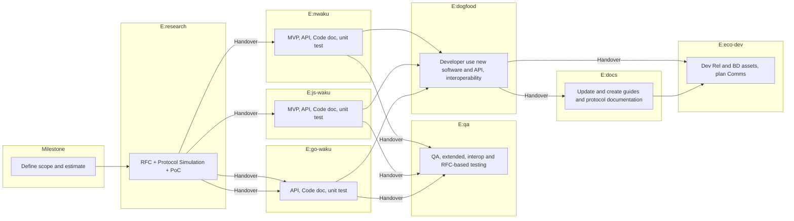

## Resources
- Waku Github: https://github.com/waku-org/
- Engineering Processes: https://github.com/waku-org/pm/blob/master/PROCESS.md

## Motivation and Goal

Implement the following attribute when delivering:

1. Clear tracking of work across the teams so that when we says that a milestone is delivered, then:
   - it is usable by all types of users (operators, web devs, system devs).
   - It is documented (docs, dev rel)
   - It is of high quality (QA, Dogfooding)
2. Items (epic, milestones) can be easily be closed and marked as complete thanks to:
    - Minimal external dependencies
    - Minimal intra-team dependency
    - Finite, well-define scope.
3. Each milestone and the effort needed to achieve it has a clear value thanks to a well-defined, value-driven, minimal, scope.

## Terminology and Scope

| Name         | Number of             | Timeframe                                      | Team Scope                                      | Owner                  | Description                                           |
|--------------|-----------------------|------------------------------------------------|-------------------------------------------------|------------------------|-------------------------------------------------------|
| Milestone    | ?                     | Pencilled for the year, planned for 2 quarters | Most subteams                                   | Waku Lead              | A, or cohesive set of, feature(s).                    |
| Epic         | Several per milestone | Set for a milestone                            | Usually one subteam or external team (e.g. DST) | Subteam Lead or Member | Milestone work for a given subteam.                   |
| Task         | Many per Epic         | Set monthly-ish, delivered weekly              | One subteam or individual                       | Team Member            | May be one or several piece of work, client specific. |  

## Milestone Definition

A *Milestone*:

1. **Provides a tangible user benefit:** The milestone should aim to provide a distinct benefit or feature to the user, whether they are end users, operators or developers. In some case, a milestone may be a bundle of small features. The bundle of features should be cohesive and the benefit to the users should be easy to summarize. Most likely, a bundle milestone will be scoped to a given track.
2. **Minimal Scope:** The milestone should be trimmed to a minimal scope, encompassing only what is *just enough* to assess the potential impact of these features on the project's metrics (e.g. number of users, revenue). This means descoping any advanced features and aiming for a MVP-level delivery.
3. **Transversal:** While the vertical scope of a milestone should be minimal, the delivery should be complete in terms of research, engineering, QA, documentation and dev rel assets so that the feature can be pushed to users once the milestone is marked as complete. Feedback loops should be as small as possible to ensure the value of a milestone is measured in a timely manner.
4. **Attached Estimate:** An estimate should be associated with the milestone to facilitate the measurement of potential ROI. Additionally, tracking the estimate versus the actual progress is crucial for identifying any deviation and making informed decisions (e.g., deciding whether to continue if we learn the estimate is likely to be overrun).

## Milestone scoping process flow

Phase 1: Waku lead defines the scope within the Milestone. The scope is then discussed asynchronously in the comments of the GitHub issue by relevant subteams and stakeholders, scope of Epics and subtasks are defined.

Phase 2: During a Waku PM call, the team reviews the Milestone to confirm scope or identify areas that require additional scoping.

Phase 3: If the scope is agreed upon, the team can proceed to create Epics and schedule work for kickoff.

## Epics and Workflow

A *milestone* is divided in *Epics*. Each *epic* is assigned to a given subteam.

Each Waku subteam lead (or selected member) is accountable for the delivery of their epic.

Typically, each *milestone* will be divided in the following *epics*:

| Epic Label Prefix | Owner Sub-team           | Output                                                                             | Description                                                                                                                                                                                                                                  |
|-------------------|--------------------------|------------------------------------------------------------------------------------|----------------------------------------------------------------------------------------------------------------------------------------------------------------------------------------------------------------------------------------------|
| `E:research`      | Waku Research            | PoC, RFC, Protocol Simulations/Studies                                             | Initial work done by the research team to create or change a protocol. Engineering-only Milestones may not have such epic                                                                                                                    |
| `E:nwaku`         | nwaku                    | MVP quality software                                                               | Bring software to MVP level, proceed with re-architecture of PoC if needed, ensure functionality is usable, refine APIs, auto-generated/API documentation, ensure interoperability works                                                     |
| `E:js-waku`       | js-waku                  | MVP quality software, including all supported env (e.g. React Native & Web)        | Implement protocol in js-waku, same as nwaku.                                                                                                                                                                                                |
| `E:bindings`      | nwaku                    | MVP quality software for supported bindings (WIP)                                  | Expose new protocol/features on binding APIs.                                                                                                                                                                                                |
| `E:go-waku`       | go-waku                  | MVP quality software, include all supported bindings (i.e. C and Rust)             | Implement protocol in go-waku, only if needed by Status app.                                                                                                                                                                                 |
| `E:qa`            | Vac/DST                  | RFC-based + functionality based tests, both unit and integration tests.            | Test engineers take over and complete unit tests + add scenarios in integration test framework. In future, also add scenario to benchmark suite.                                                                                             |
| `E:dogfood`       | js-waku, nwaku, bindings | Lab example updates, own nodes updated, etc.                                       | Each dev team proceed by dogfooding the feature/API by using it themselves. Whether it is running their own node, or updating a selected number of examples. Go-waku can dogfood directly in status-go.                                      |
| `E:docs`          | Doc                      | Documentation (not auto-generated)                                                 | Document the new feature across all implementations, using the dogfooding output as handover material from engineering teams. This includes both coding guides but also a presentation ready visual documentation of the protocol behaviour. |
| `E:eco-dev`       | Eco Dev                  | Dev Rel assets (examples, video tutorial, etc), comms plan (X threads, blog posts) | Dev Rel can now prepare assets to push the feature to developers, comms can prepare copies to communicate about it, BD can push it to projects and partners.                                                                                 |

### Engineering-Only Milestones

Some milestones may not involve the Waku Research team. In this case, the flow still applies but `E:research` is skipped.

### Chat SDK and other Special SDK Work

The Chat SDK team is focusing on go-waku integration in status-go and follows Status' PM for issues and labelling.

Once the team starts building an independent Chat (or other) SDK, the flow will be as above but with research handled by VAC/ACZ and only one dev team:

| Epic Prefix  | Owner Sub-team | Output                                             | Description                                                |
|--------------|----------------|----------------------------------------------------|------------------------------------------------------------|
| `E:acz`      | Vac/ACZ        | RFC                                                | RFC describing a specific, likely agnostic protocol        | 
| `E:chat sdk` | Chat SDK       | PoC and then MVP quality software, Application RFC | Implement the ACZ RFC, define API and application protocol |

Handover to QA, Docs, Eco Dev with MVP quality software is still expected down the track but may be pending growing teams.

### Accountability

Each epic should have an owner per subteam.
Most epics will have a unique owner (e.g. a Waku Research team member owns a `E:research` epic).
For _Dogfood_ and _QA_ epics, one owner per client should be set.

The epic owner is responsible for breaking down the work in smaller issues in the related repo.

For research team, it is expected that most of the research work is done by the epic owner, which includes:
- Capturing problem statement
- Designing protocol/solution
- Implementing PoC in reference implementation
- Running tests/simulations to confirm behaviour (to be offloaded to test engineer)

For development teams, it is expected that design/break down is done by the epic owner.
But actual work can be picked up by other team member.
Epic owner must:

- Understand the change and its implications,
- Liaise with researcher for any doubt or questions or design issues related to specific client/use case,
- Create issues (_Tasks_) to break down work in client repo, include an _acceptance criteria_ in each issue to ensure that the objective/end goal/behaviour is clearly described.

It is likely that the epic owner will do the core change or first change for a given epic.
However, subsequent/other changes may be picked up in parallel or sequentially by other team members.

Hence:
- dependencies must be clearly stated in _Task_ issue description
- Team members must assign _Task_ issues to themselves when work starts
- Team members must update issues to track progress

The program manager should ensure that epics are getting the right assignee in a timely fashion.
For example, when research work starts for a given milestone, epic owners from development team should be assigned, so they know to participate in discussions.
Program manager should also ensure that issues are being created in a timely fashion,
an is encouraged to use client PM call as a forum to check epics to be assigned, for example when a given epic is near completion.

### Handovers

The following handovers are defined:

| Handover                      | Expectations when handing over                                                                           | Expectations when accepting handover                                                                  |
|-------------------------------|----------------------------------------------------------------------------------------------------------|-------------------------------------------------------------------------------------------------------|
| Research to development teams | - RFC PR is merged   - PoC PR is merged                                                             | - RFC content and PoC are reviewed   - Own code and functionality   - Own minor RFC changes |  
| Development teams to QA       | - Happy path and selected error path tests exist   - APIs are implemented to enable interop testing | - Review RFC   - Review existing tests                                                           |
| Development teams to Docs     | - Working usage of API is provided   - Auto-generated documentation for public API is present       | - Review examples   - Understands functionality                                             | 
| Docs to Eco Dev               | - Docs PR is merged with functioning code                                                                | - Understands functionality   - Execute guides                                                   |

The group or person handing over is expected to initiate a sync (meeting) or async (chat or GitHub) discussion to go through the output and overview.

Once the handover is accepted, the given epic can be closed.

### GitHub Usage

A _Milestone_:
- MUST have a matching GitHub issue in the https://github.com/waku-org/pm repo with `milestone` label assigned.
- MUST have a GitHub Milestone in https://github.com/waku-org/pm repo, to which relevant _Epics_ are added.
- The GitHub milestone MUST be used to track progress.

An _Epic_:
- MUST have a matching GitHub issue in the https://github.com/waku-org/pm repo.
- MUST have a label with format `E:<prefix> <epic name>`.
- SHOULD be added to a GitHub Milestone.
- SHOULD have a `Planned Start` and `Due Date` set (these are GitHub projects fields you can find in the `Projects` section of the issue view sidebar).
- MAY list _Tasks_ present in other repos.
- MUST have assignee(s), who represent the epic owner (see [accountability](#accountability))

A _Task_:
- MAY be tracked as a todo item in a GitHub Issue (_Task_ or _Epic_),
- OR MAY be tracked as a single GH issue
    - that MUST be labelled with related _Epic_ label (`E:...`),
- OR MAY be tracked as a GH Pull Request
    - that MUST have a reference to the related GitHub _Task_ or _Epic_ issue
- MUST have an _acceptance criteria_ and/or a list of _tasks_ (that can be other GH issues).

Finally, for _Tasks_ that do not belong to a given _Epic_ or _Milestone_:
- MUST have either labels:
    - `bug`: This is a bug, likely reported by a user
    - `enhancement`: This is an enhancement out of the scope of the technical roadmap, likely reported by a user
        - Major enhancements should be carefully reviewed and prioritized.
    - `documentation`: Documentation improvement or correction.
    - `dependencies`: Upgrade dependencies in a timely manner to avoid time wasting when the dependency upgrade becomes critical.

Which means, in terms of _navigation_:

- Work for a Milestone is described in the related GitHub issue and tracked in the GitHub milestone.
- In the GitHub milestone, we have a list of _Epics_ to be achieved, the _Epics_ are being closed as the work is done and handed over.
- To look at remaining work for an _Epic_, one need to look at all issues (_Tasks_) with the corresponding _Epic_ label (`E:...`)